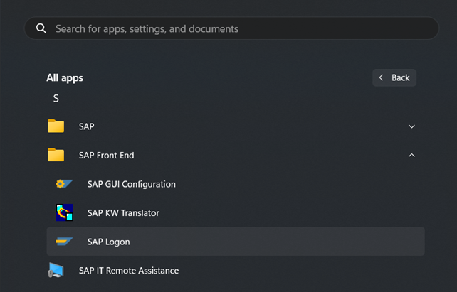
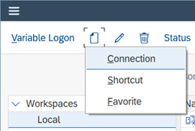
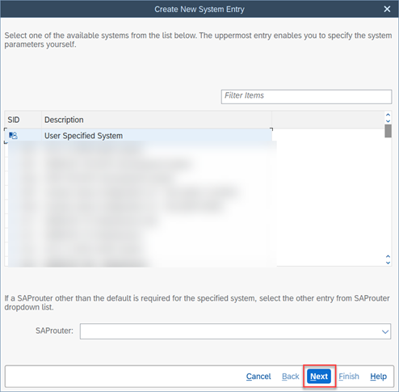
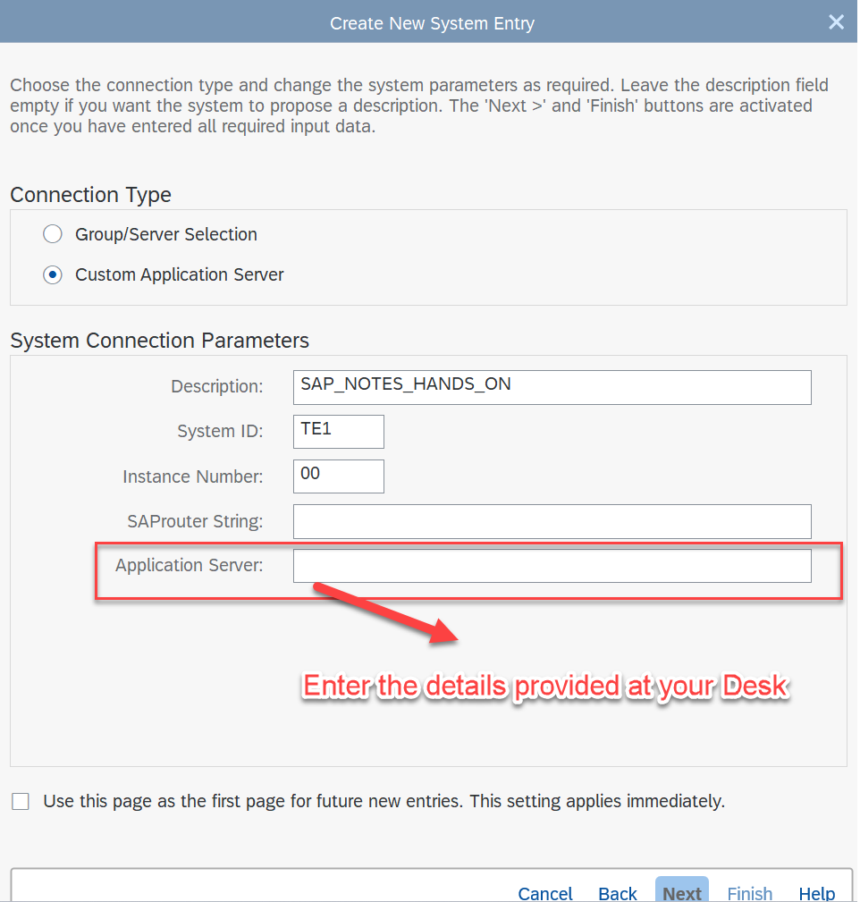
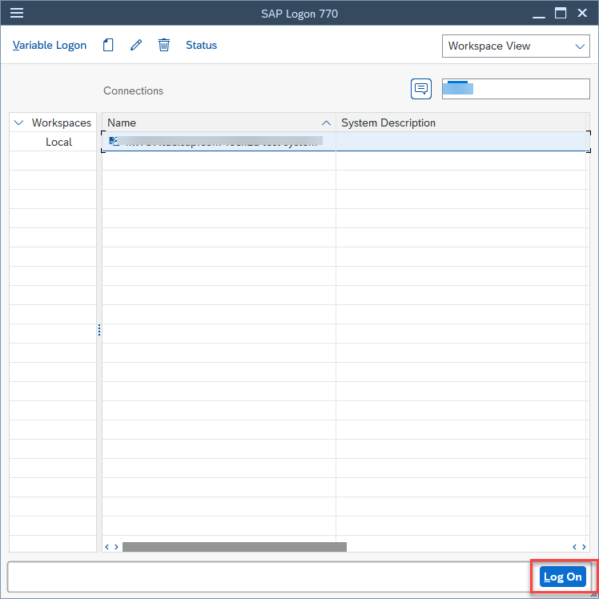
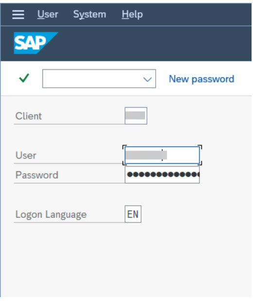

# Login to System
In this exercise, you will be creating the connection to the test system in SAP Logon pad. 

1.	Open SAP Logon application from the laptop windows menu.
   
     

2.	Use the ‘New -> Connection’ button to create a system:
   
     
               

3.	Keeping the cursor on ‘User Specified System’, click on next:
   
    

 

<!-- 4.	Fill the details as provided in the ‘System and User’ section of this document:
    Server: nw757.tdc.sap.com
    Instance: 00	
    System ID: TE1  --> 

4.  You would have received the application server details. Fill the details here along with Instance and System ID fields.
    >Description: SAP_NOTES_HANDS_ON

    >Instance: 00	
    
    >System ID: TE1

    

   <!--  -->

 

5.	The added system will now appear in the list of systems:
   
     

 

6.	Select the system and click on ‘Log On’. The login screen should appear. Provide the client and user details as below:

   >Client : 001
>
   >User: HANDS_ON
>
   >Password: hands_on@123

   

 
You will be logged into the system now.

Please proceed with the first exercise – [Exercise 1: Batch Identification](../ex1/README.md).
