# Exercise 2 - Batch Implementation

Batch Implementation option enables you provide an SAP Note or a range of SAP Notes for which you want to either schedule an implementation or download the mentioned SAP Notes along with its pre-requisite SAP Notes. 

In this exercise, you will be implementing multiple SAP Notes in a single batch job and then viewing the results. 

## Exercise 2.1 Adding SAP Notes for pre-requisite Identification and Note implementation in Batch Job

  1. Relaunch transaction SNOTE. To do this, type ‘/NSNOTE’ in the top-left section of the screen. 

    
     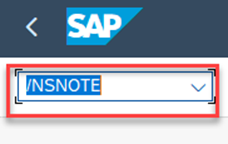
     

  2. In ‘Note Assistant – Home’ screen, navigate to the menu option ‘Batch Processing -> Batch Implementation’.

     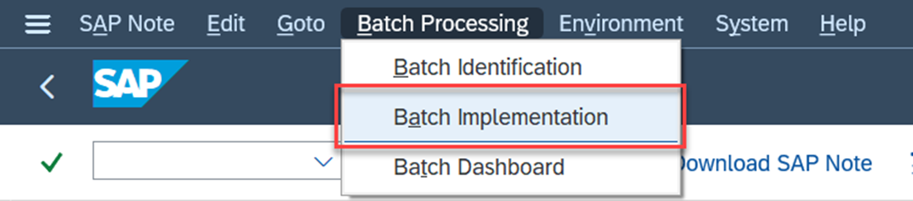

  3.	You would have navigated to ‘Schedule SAP Notes Batch Implementation’ screen. This is where you would need to provide the list of SAP Notes.
      Click on the multiple selection button next to ‘SAP Note Number’.

         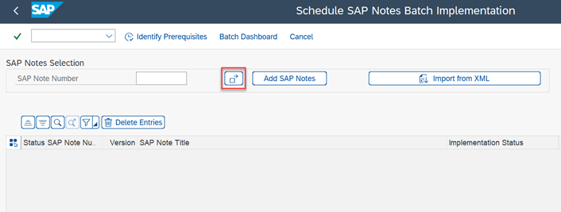

     

  4. Provide the below SAP Notes in the pop-up that opens.

         2909538
         3333874

     Click on ‘Copy (F8)’.

     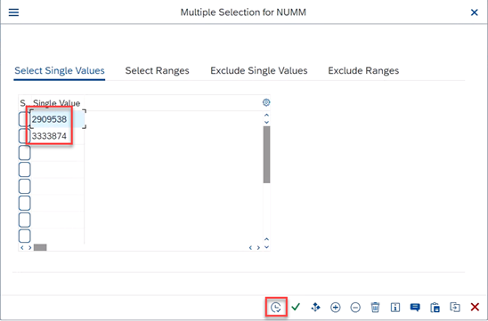
     

5.	Click on ‘Add SAP Notes’.

      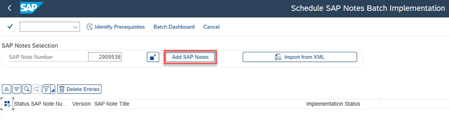

   

6.  The Notes should now appear in the bottom section of the screen. A status of green or yellow traffic lights indicate that the SAP Note might be possible to be implemented in a batch job. 

      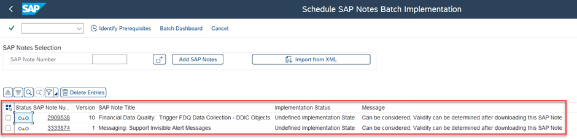

     

7.	These input SAP Notes may have pre-requisite SAP Notes which also needs to be implemented together with these input SAP Notes. Choose ‘Identify Prerequisites’ to identify all such pre-requisite SAP Notes.

     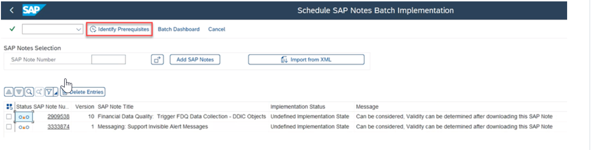

    

8.	You will be navigated to a new screen which shows all the pre-requisite SAP Notes for every input SAP Note.

     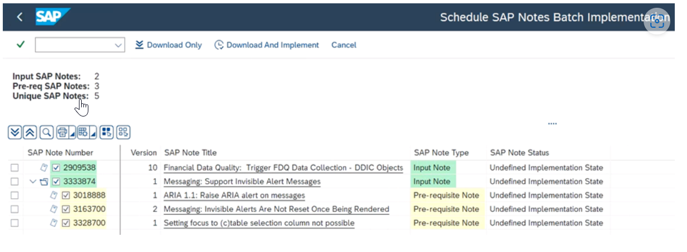

   

9.	Now we will schedule a batch job to download and implement all the SAP Notes. Choose ‘Download and Implement’ button for this.
    
    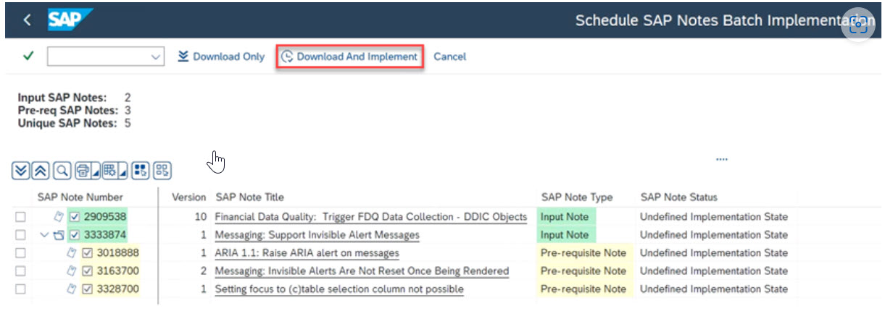

    

10.	A pop-up will open. You will be required to provide a job/schedule description and a transport request. Provide the Job/Schedule Description as ****'Batch_Implementation_<your laptop/desk number>****'. Provide the transport request that you created earlier as well.
    
    >Hint:
    >
    >You can use the small button next to the Transport Request field to find the previous transport request.
    >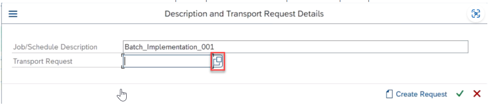
    >
    >In the screen that opens, click on 'Execute (F8)'
    >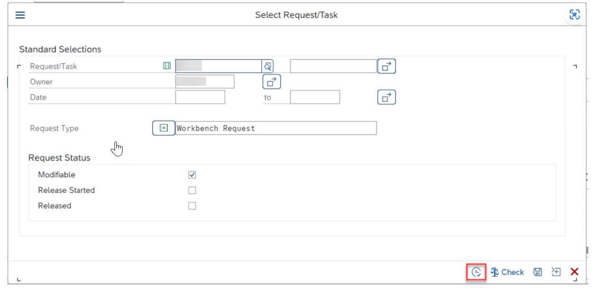
    >
    >In the screen that opens, select the transport request that you created earlier.
    >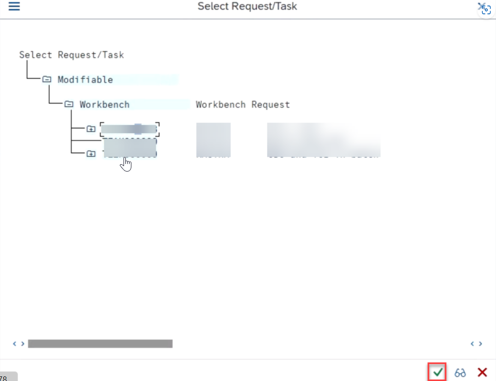
    >
    >This transfers the transport request number to the relevant field.

    Click on the Ok button in the pop-up to schedule the job.

   	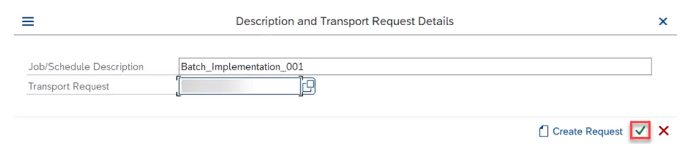

    

11.	You have just created a Batch Implementation job!

    A pop-up confirming the action with the job details will be shown. Click on the ‘Go to Batch Dashboard’ button in the pop-up. This will navigate to the batch dashboard where you will find the status and results of the job that you have scheduled.

    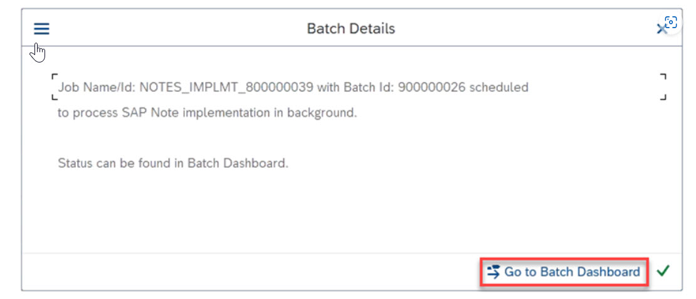

    

12.	The job can take a couple of minutes to complete. You can use the ‘refresh’ button to update the status in the Batch Dashboard.

   	Once the job is complete , you can continue with the next exercise: [Viewing the Implementation Results](../ex2/README.md#exercise-22-viewing-the-implementation-results).

## Exercise 2.2 Viewing the Implementation Results

In the previous steps, you have scheduled a job which will implement SAP Notes. Now, we will view the implementation results. You have already viewed the implementation results for Note implementation done during the Batch Identification in the previous exercises and this is very similar.

1.	At the end of the previous step, you would have navigated to the ‘SAP Notes Batch Identification/Implementation Dashboard’. You will find the job details with a description matching what you have provided in the previous step. Locate the Run for Schedule type ‘Note implementation’. You will find a button ‘Implementation Result’ corresponding to this Run. Click on the button.

    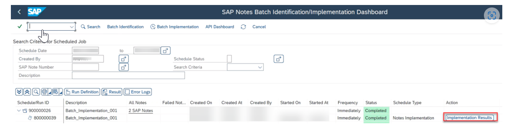

2.	You would have navigated to the ‘SAP Note Batch Implementation Results’ screen. 

    This screen shows all the SAP Notes processed by the batch job. You will find the implementation statuses of the SAP Notes and information/error messages, if any, against each SAP Note.

    Use the checkbox to select a line for the SAP Note which is completely implemented and has the message ‘Object generating report..’. 

    >The message against the SAP Note mentions that an object generating report has also been executed. As the name suggests, such reports can generate ABAP objects. These ABAP objects are not supported by a standard SAP Note implementation, and therefore a report execution is necessary to generate them. If any such report is found in an SAP Note, then the Batch implementation will also execute these reports in the same batch job, once the report is created during the SAP Note implementation. Any relevant manual activity in the same SAP Note will also be confirmed automatically, as you will find in the below steps.

     Click on the button ‘Note Log’ to view the implementation logs of the SAP Note.

     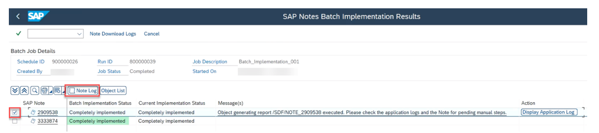

3.	Observe the results.
   
   
    >You will find that the job has automatically confirmed a manual activity. This will be the manual activity which guides the user to execute the object generating report. The report has been executed in the same background job, hence the manual activity has also been automatically confirmed. 

    Once done close the pop-up for Note Batch Implementation Logs.
 
    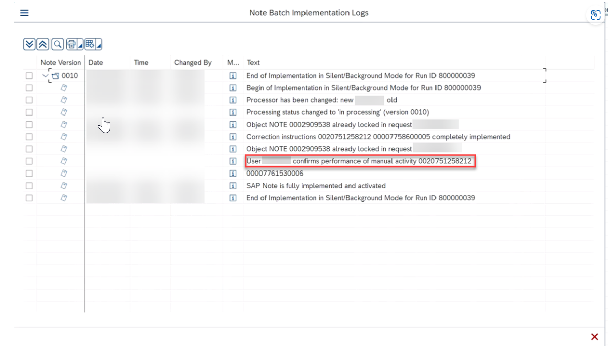

4.	Keeping the checkbox for the same SAP Note selected, click on button ‘Object List’. This will show the list of objects processed by the SAP Note along with its simulation results.

     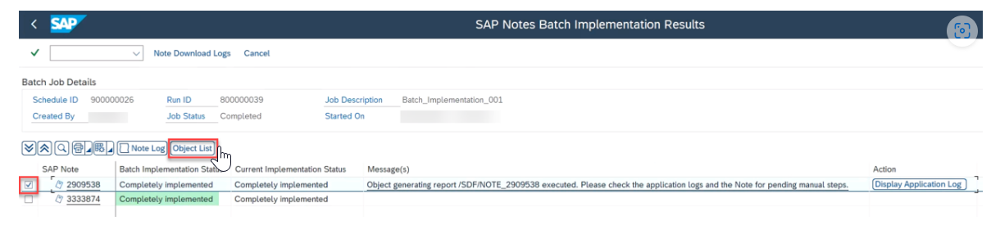

5.	Observe the results. This will be the object generating report created during the Note implementation.

     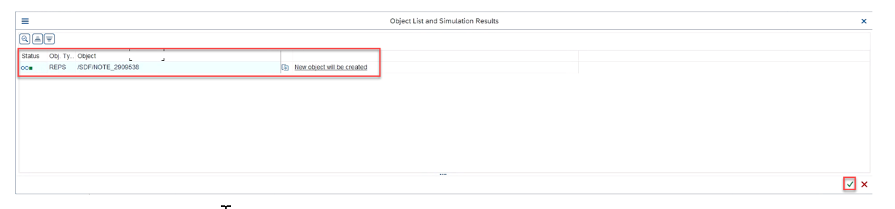

     Once done close the pop-up for SAP Note Batch Implementation Results.

6.	To view the application logs for the object generating report execution, choose the button ‘Display Application Log’ next to the relevant SAP Note.

    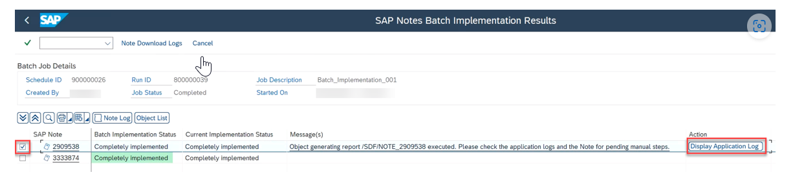

7.	The tool navigates to the application logs. Observe the results.
   
     >This will contain all the objects created/modified during the report execution which happened in the same background job. You can notice that the object generating report name is also mentioned in the column ‘Program’.

     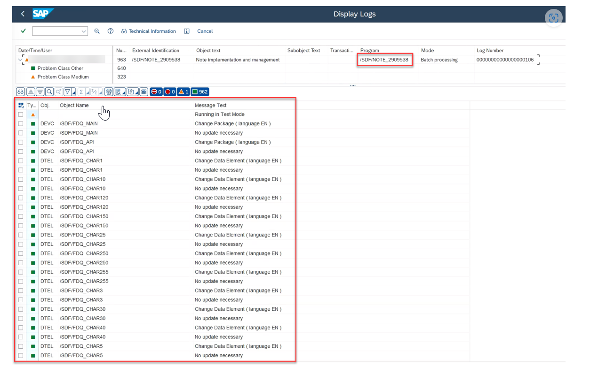

 

## Summary

Awesome! You have now completed the exercise for Batch Implementation. 

Please proceed with the next exercise - [SAP Note Analysis and Batch Implementation using Note Analyzer](../ex3%20#sap-note-analysis-and-batch-implementation-using-note-analyzer)

