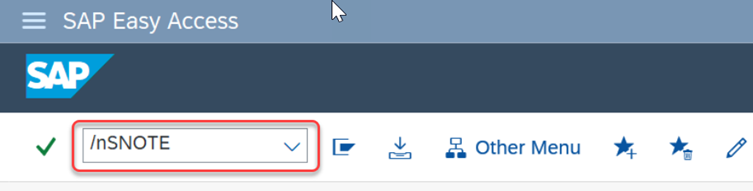
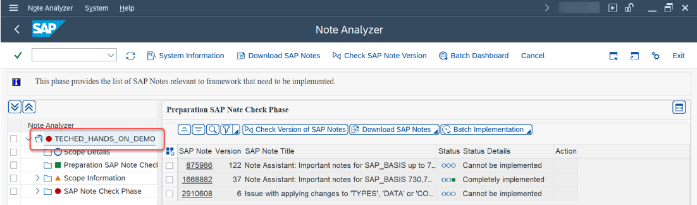

# Exercise 3: SAP Note Analysis and Batch Implementation using Note Analyzer

Note Analyzer is a tool that allows you analyse the SAP Notes provided by SAP in a file format. The SAP Notes may be belonging to a certain functionality and helps you to ensure that the functionality is up-to-date in your system. The tool analyse and suggests possible actions depending on the result. 

By the end of this Exercise, you will know how to launch Note Analyzer, from where to download the input XML files, how to upload the XML file and how to interpret the analysed result and take actions.

## Exercise 3.1: Launch Note Analyzer
1.	Go to transaction /nSNOTE to launch ‘Note Assistant – Home’ screen.

    

2.	In ‘Note Assistant – Home’ screen, navigate to the menu option ‘Goto -> Other Tools -> Launch Note Analyzer’.

    

3.	You would have now reached to the Note Analyzer Home Start Screen.
    Here you can have the option to Upload the XML file and rerun the already uploaded XML File.

    

## Exercise 3.2: Analyze SAP Note

### Exercise 3.2.1: Download XML File 

1.  On the left of this page, you will find a file with the name 'TECHED_HANDS_ON_DEMO.xml'. You can click on it and find an option to download the file. Your file will get downloaded and get saved in the Downloads folder of the system. Navigate back to this screen once done.

    
  
    

    >The above steps are only for the purpose of today's hands-on session. Generally, you would be downloading the file from the SAP ONE Support Launchpad. Below are the steps to do so, but it may not be possible in today's session because of access restrictions to SAP ONE Support Launchpad.
    > 1.	First step is to download the XML file. 
    >Go to the link [https://me.sap.com/notes/3383921](https://me.sap.com/notes/3383921).
    >
    >   
    >
    >
    >2.	Click on 'Attachments' Tab.
    >
    >   
    >
    >4.	Click on file TECHED_HANDS_ON_DEMO.XML
    >
    >   
    >
    >   Your file will get downloaded and get saved in the Downloads folder of the system.
    >
   

### Exercise 3.2.2: Upload the XML

Next step is to upload the XML file.

1.	Go back to Note Analyzer window
   
2.	Click on Upload

  	

3.	Choose the XML file.	
    Navigate to folder where the file got saved. Here it got saved in Downloads. 
    Choose file “TECHED_HANDS_ON_DEMO.xml”  Click on ‘Open’.

    

    Click allow if you get the below pop-up

    

    Now the file is loaded to the system.

### Exercise 3.2.3: Analyze the Uploaded XML

1.	Click on “Analyze”

    

2.	Result is now ready to analyze by following the below steps.

    

    >The overall status of the Note Analyzer is in Red with Preparation SAP Note Check Phase, SAP Note Check Phase with status Red and Scope information with Yellow. After taking all the necessary action everything except the Scope information phase will become Green. The overall status shall also become green.

    Now it’s the time for the deep dive into the details of the tool. We can take the action one by one to finish the Analysis.

#### Action 1: Preparation SAP Note Check Phase

At the beginning of this activity, you will make the SNOTE up to date.

1.	Click on the hyperlink ‘Action Needed’ against the First Phase ‘Preparation SAP Note Check Phase’.

    

    These are the SAP Notes needed in your system to make the SNOTE up to date. From this screen you can read it as out of 3 SAP Notes, currently 1 SAP Note is required to make your SNOTE up to date. All the action needed SAP Notes will be with status .

    

2.	Next step, take the pending action on this SAP Note.
   
    >The column Valid Prerequisite indicates here how many Pre-requisites is needed for this SAP Note to get successfully installed.
    
    Click on the Button against on ‘Action’ Column for the SAP Note 1668882. The action column indicates the Button to Implement.

    

    Now the implementation of this SAP Note has started along with its pre-requisites.

<!--3.	If Asked, Choose the Transport Request TE1K900024 by clicking on the button ‘Own Request’. If you don’t see the below pop up proceed to step 5.

    

4.	Once the Transport Request is selected, click on Continue Button.

      -->

3.	Now you will be seeing the object list. Click on the Next Button to finish the SAP Note Implementation 

    

    Now you can see the needed SAP Note 1668882 in Completely Implemented Status with Green Traffic Light and the ‘Preparation SAP Note Check Phase’ turned to ****Green**** from ****Red****.

    

   You have now successfully completed the Action 1 and made SNOTE up to date.

#### Action 2: Manual Activities Needed
Here you will be performing any Manual activities mentioned by SAP for the completeness of the process.

1.	Double Click on the Main Node to reach Overview Page 

    

    

2.	Click on the View Details to get into the details. 
    Scope information will always be in Yellow Traffic as it’s a Manual Activity that has to be performed by the customer if needed in their system.

    

   
3.	The message over here is to execute a Report before proceeding.

    

4.	Let’s perform this activity.
    Create a new GUI Window: Click on the 3 lines in the extreme left top Corner and then click New GUI Window.

    

5.  Enter Transaction as /nSE38 and press ‘Enter’.

    

6.	Input the Report Name N_PREPARTION_APPL and Click on Execute 
.

    

    

7.	Now you have performed the Manual Activity mentioned.
   
    >This is an example of Manual Activity. SAP can provide any type of comments or activities over here.
    
8.	You can move to the Last Action. Go back to the Note Analyzer Screen now.

#### Action 3: SAP Note Check Phase

Here you will get an overview of all the SAP Notes needed for the application and the next action for the same. 

1.	Double Click on the Main Node to reach Overview Page. 

    

    

2.	Click on the ‘Action Needed’ hyperlink against SAP Note Check Phase.

    

3.	You now reached to the SAP Note Check Phase.
    Three SAP Notes here needs an action.

    

4.  Click on the SAP Note 3367975.

    >Clicking on this link will give you the full details of this SAP Note.

    

    This SAP Note is opened in SNOTE transaction in a new session as the SAP Note is already downloaded in the system.

    

    You can now close this newly opened window.

5.	 Click on the SAP Note 3369905.

     >Clicking on this link will give you the full details of this SAP Note.

     

     Click on ‘Allow’ if you get the below screen.

     

     This SAP Note will open in [https://me.sap.com](https://me.sap.com).

     >In case you are unable to access this link, you can ignore this step and proceed to next step.

     Here the SAP Note file is not yet downloaded to the system hence it opened in browser.

     

6.   You can now close the browser window and go back to Note Analyzer Screen.

7.   Observe the icon Changes in Action Column. Hover over each icon to get the Tool Tip.
     First two SAP Notes are with Action Implement 
  as these are already downloaded to the System.

     

     Third SAP Note is with Action Download 
 . This action will change to implement Action once the SAP Note is downloaded to the system.

8.	 Click on the Hyperlink ‘Details’ against any one SAP Note.

     

     This will give the information of what type of Correction Instruction this SAP Note has like whether the SAP Note contain Automatic Correction Instruction or Manual Correction Instruction etc.
     Click OK to close the same.

     

9.	 Click on hyperlink against the SAP Note 3367975 in Valid Prerequisite column.
    
     

     This will display the valid prerequisite for this SAP Note in the current system.
  	 
     >This list may have few invalid prerequisites SAP Note as well. This detail is available even if the SAP Note is not downloaded to the system. 

     Click OK to Close the window.

     

10.	 Click on the ‘More info’ column button against the SAP Note 3367975.   

     

     This shows the validity of the SAP Note. Click ‘Ok’ to close the same.

     

11.	 Implement the needed SAP Notes.

      >We can either implement the needed SAP Notes one by one in foreground by clicking on the ‘Action’ Button against the individual SAP Note, or we can implement multiple SAP Notes in background.

      In this exercise, we will use the background process to implement all SAP Notes from the Note Analyzer in one go.

      Click on the ‘Batch Implementation’.

      

      >We can Implement selected SAP Notes in Background or we can implement all valid SAP Notes from the list in background.

      We will go ahead with all valid SAP Notes. Click on ‘All Valid Notes’.

      

12.	Enter the Transport Request as TE1K900024 then click ‘Ok’.
         
    

13.	Your Job to implement all the Valid SAP Notes has been scheduled. Click on ‘Go to Batch Dashboard’ to view the background job details.

    

    This is the same dashboard you have already seen in your prior exercises. The display will be filtered with the Schedule IDs for the Current XML. The description of the Schedule/Run ID is “SNOTE_NA_(Name of the XML).

    If the Schedule Status in In Progress, click on ‘Refresh’ button to get the Latest status. The Job can take 1 – 2 minutes to complete.

    

    

    You have now successfully scheduled and implemented the Job from Note Analyzer tool.

## Exercise 3.3: Conclusion    

You have now completed all the actions required for the input XML. 

1.	Click on Back Button to Navigate back to the Note Analyzer.

    

2.	You are now back to the Note Analyzer Screen.    

    

    You can find that the phases are now turned to **Green** along with Main Node (except the Scope information phase, as explained earlier in action 2 of exercise 3.2.3). That means you have successfully implemented all the needed SAP Notes from this XML to make the application up to date.   

**Congratulations! You have now completed all the steps for today’s session!**
